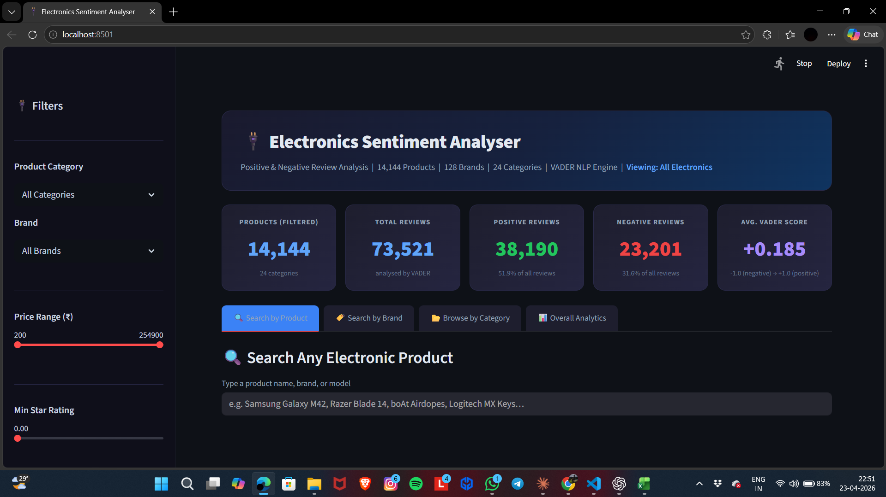
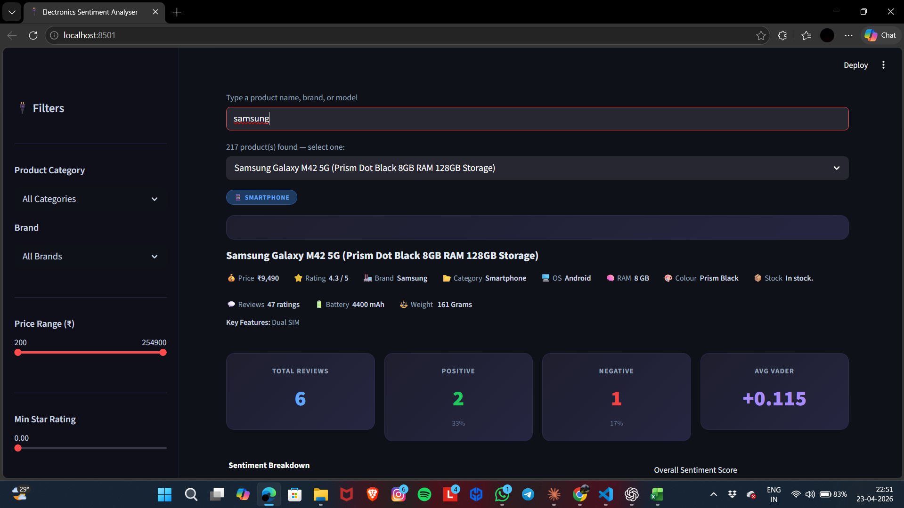
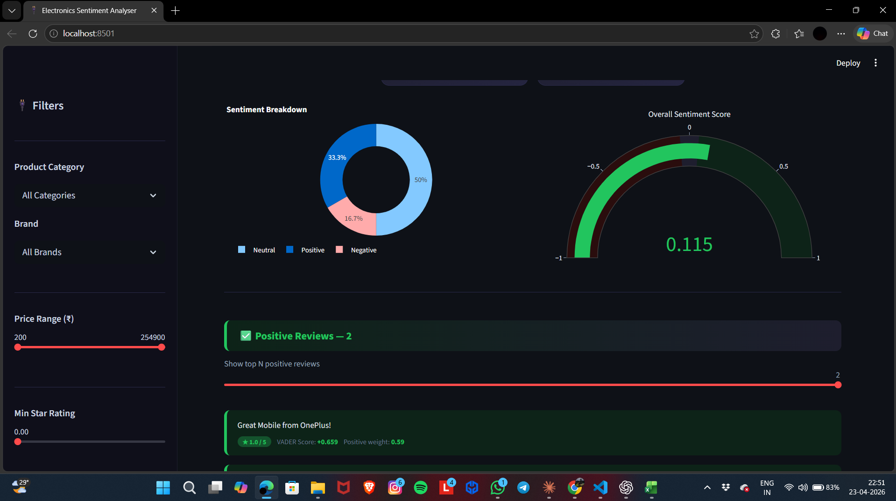
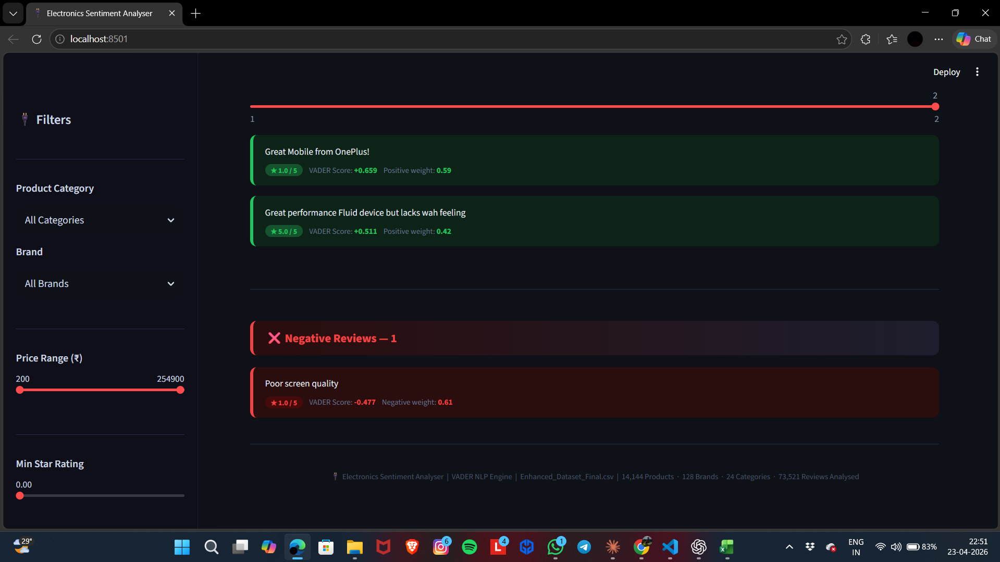

# 🛍️ Product Recommendation System

An AI-powered Product Recommendation System that analyzes customer reviews using **Machine Learning**, **Natural Language Processing (NLP)**, and **VADER Sentiment Analysis**. The application provides product insights through an interactive **Streamlit** web application.



---

## 🚀 Live Demo

🔗 https://appuct-recommendation-system-ajzrkvj978yhaxw2vf3dxf.streamlit.app/

---

## 📌 Project Overview

The Product Recommendation System helps users understand customer opinions by analyzing electronics product reviews and classifying them as **Positive**, **Negative**, or **Neutral**.

Using Natural Language Processing (NLP) and VADER Sentiment Analysis, the application provides meaningful insights through interactive visualizations, helping users make informed purchasing decisions based on customer feedback.

---

## ✨ Features

- 🤖 Interactive Streamlit web application
- 😊 Positive, Negative & Neutral sentiment classification
- 📊 Interactive sentiment dashboard
- 📈 Sentiment distribution visualization
- 📉 Product review analytics
- 🔍 Machine Learning-powered review analysis
- ⚡ Real-time sentiment prediction
- 📄 User-friendly interface

---

## 🛠️ Tech Stack

| Category | Technology |
|----------|------------|
| Language | Python |
| Web Framework | Streamlit |
| Machine Learning | Scikit-learn |
| NLP | VADER Sentiment Analysis |
| Data Processing | Pandas, NumPy |
| Visualization | Plotly, Matplotlib, Squarify |
| Version Control | Git & GitHub |
| Deployment | Streamlit Community Cloud |

---

## 📂 Project Structure

```text
Product-Recommendation-System/
│
├── app.py
├── train.py
├── Enhanced_Dataset_Final_1.csv
├── requirements.txt
├── README.md
├── .gitignore
│
└── screenshots/
    ├── home.png
    ├── sentiment_dashboard.png
    ├── positive_review.png
    └── negative_review.png
```

---

## ⚙️ Installation

### Clone the Repository

```bash
git clone https://github.com/pugalenthi19/Product-Recommendation-System.git

cd Product-Recommendation-System
```

### Install Dependencies

```bash
pip install -r requirements.txt
```

### Run the Application

```bash
streamlit run app.py
```

---

## 📷 Screenshots

### 🏠 Home Page


---

### 📊 Sentiment Dashboard



---

### 😊 Positive Review Analysis



---

### 😞 Negative Review Analysis



---

## 📖 Workflow

```text
Customer Reviews
        │
        ▼
Data Preprocessing
        │
        ▼
Feature Extraction
        │
        ▼
VADER Sentiment Analysis
        │
        ▼
Sentiment Classification
        │
        ▼
Interactive Streamlit Dashboard
        │
        ▼
Visual Analytics & Insights
```

---

## 🎯 Project Objectives

- Analyze customer reviews efficiently.
- Classify reviews into Positive, Negative, and Neutral categories.
- Visualize sentiment trends using interactive charts.
- Provide meaningful insights to assist product evaluation.
- Demonstrate the practical application of Machine Learning and NLP.

---

## 🚀 Future Enhancements

- Personalized product recommendation engine
- Deep Learning models (LSTM/BERT)
- Multi-language sentiment analysis
- User authentication
- Export analytics reports
- Real-time review analysis

---

## 📚 Skills Demonstrated

- Python Programming
- Machine Learning
- Natural Language Processing (NLP)
- Sentiment Analysis
- Streamlit Application Development
- Data Visualization
- Git & GitHub

---

## 👨‍💻 Author

**Pugalenthi E**

B.Tech Electronics & Communication Engineering

SASTRA Deemed University

GitHub: https://github.com/pugalenthi19

---

## ⭐ Support

If you found this project useful, please consider giving this repository a ⭐ on GitHub.

Thank you for visiting!